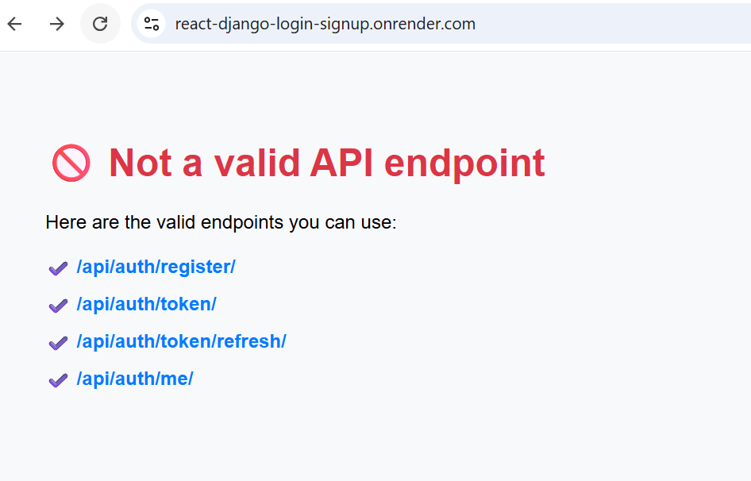

# 🔐 React + Django Login & Signup (JWT Authentication)

A clean and production-ready micro-demo showing **JWT-based login & signup**, built with **React (Vite + TypeScript)** on the frontend and **Django REST Framework + Simple JWT** on the backend.  
Perfect for dashboards, SaaS apps, admin panels, and real freelance client tasks.

---

## 🚀 Live Demo

- **Frontend Live:** https://react-django-login-signup.vercel.app
- **Backend Live API:** https://react-django-login-signup.onrender.com
- **GitHub Repository:** https://github.com/ranjeet-singh/react-django-login-signup


---

## 🖼️ Project Thumbnail


---

## ✨ Features

- 🔐 **JWT Authentication** (Access + Refresh tokens)
- 📝 **Signup** with validation & password confirmation
- 🔑 **Login** with session persistence
- 🔁 **Token refresh** using Axios interceptors
- 🔒 **Protected routes** using `PrivateRoute`
- 👤 **Authenticated user fetching** (`/auth/me`)
- 🚪 **Logout** with token cleanup and redirect
- 📱 **Mobile-responsive UI** with Bootstrap 5
- 🧼 Clean, modular frontend + backend structure
- 🚀 Ready to extend for production apps

---

## 🧱 Tech Stack

**Frontend**
- React (Vite + TypeScript)
- Axios
- React Router v6
- Bootstrap 5

**Backend**
- Django
- Django REST Framework
- Simple JWT

---

## 🗂️ Folder Structure

### **Root**
```
project-root/
├── backend/
├── frontend/
└── qa/
```

### **Backend**
```
backend/
├── auth_api_demo/
├── templates/
├── users/

```

### **Frontend**
```
frontend/
├── node_modules/
├── public/
├── screenshots/
└── src/
```

---

## ⚙️ Backend Setup (Django)

```bash
cd backend
python -m venv venv
venv\Scripts\activate  # Windows
pip install -r requirements.txt
python manage.py migrate
python manage.py runserver
```

Backend runs at: **http://127.0.0.1:8000**

---

## 💻 Frontend Setup (React + Vite)

```bash
cd frontend
npm install
npm run dev
```

Frontend runs at: **http://localhost:5173**

---

## 🔐 Auth API Endpoints

| Endpoint | Method | Description |
|----------|--------|-------------|
| `/api/auth/register/` | POST | Register a new user |
| `/api/auth/token/` | POST | Login (access + refresh tokens) |
| `/api/auth/token/refresh/` | POST | Get new access token |
| `/api/auth/me/` | GET | Fetch authenticated user |

All protected requests require:

```
Authorization: Bearer <access_token>
```

---

## 📸 Screenshots

### **Login Page**


### **Signup Page**


### **Dashboard Page**


### **Logout Page**


### **Backend Root (API Overview)**


---

## 📤 Deployment (Add URLs After Deploying)

### **Frontend — Vercel**
1. Push code to GitHub  
2. Import into Vercel  
3. Add env:  
   ```
   VITE_API_URL = https://your-backend-url.onrender.com
   ```
4. Deploy & copy live URL

### **Backend — Render**
1. Create Web Service  
2. Add environment variables:  
   - `SECRET_KEY`
   - `DEBUG=False`
   - `ALLOWED_HOSTS`
3. Configure gunicorn:  
   ```
   gunicorn auth_api_demo.wsgi:application --bind 0.0.0.0:$PORT
   ```

---

## 📌 Tags

`React` `Django` `JWT Auth` `TypeScript` `Fullstack` `Bootstrap` `Portfolio Project`

---

## 👨‍💻 Author

Made with ❤️ by **Ranjeet Singh**  
GitHub: https://github.com/ranjeet-singh

---

## 📝 License

This project is open-source under the **MIT License**.
